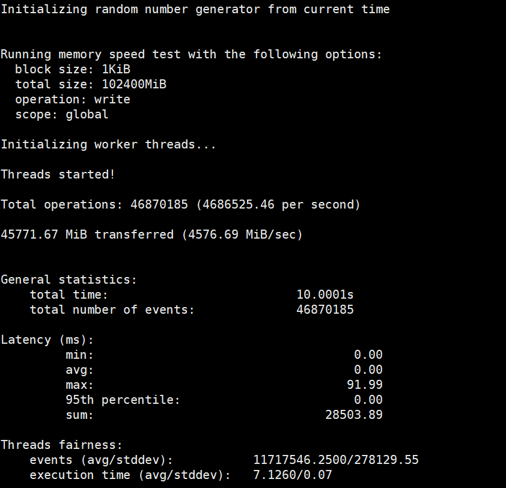

# openEuler-tidb-tset
## CPU测试


## memory测试



## 线程测试


## 数据库测试
此次载入数据量
官网示例数据量为32张表 每张表10000000数据，本系统内存目前200G，root目录167G。选取原来数据的1/100，约25G大小。也就是320万数据量作为测试，载入数据耗时12h.

```bash
sysbench --config-file=config oltp_point_select --tables=32 --table-size=100000 prepare
```
### Point select 测试
#### 32线程


#### 64线程


#### 128线程


#### 256线程


#### 512线程


>可以得知随着线程数增加，queries值不断升高。

### Update index 测试
#### 32线程


#### 64线程


#### 128线程


#### 256线程


#### 512线程


>可以得知随着线程数增加，queries值不断升高。但是在256线程时候最高，后面逐渐下降

### Read-only 测试
#### 32线程


#### 64线程


#### 128线程


#### 256线程


#### 512线程


>可以得知随着线程数增加，queries值不断升高。但是在256线程时候最高，后面逐渐下降，而且在线程数高于256之后测试逐渐不稳定，线程数高于260之后大部分readonly测试报零

## 最终测试基准极限数据为256线程下的数据

### point


### update


### readonly

